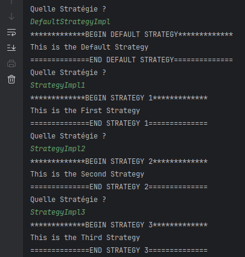
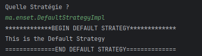
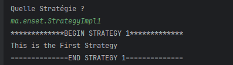
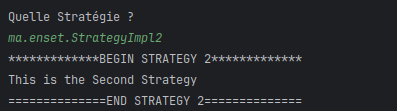
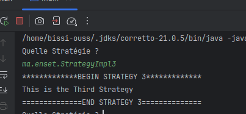

# Activité Pratique - Implémentation du Design Pattern **Strategy** en Java

Ce dépôt contient une implémentation pratique du **Design Pattern Strategy** en Java. Cette activité fait partie du cours de **Design Patterns** encadré par **Mr YOUSSFI Mohamed**.

## Aperçu du projet

### Design Pattern Strategy

- **Objectif** : Démontrer la mise en œuvre du design pattern **Strategy** en Java, permettant de définir une famille d'algorithmes et de les rendre interchangeables à l'exécution.
- **Technologies utilisées** :
  - `Java` pour l'implémentation de l'algorithme et de la logique de design pattern.
  - Structure simple, sans framework spécifique (fonctionne avec n'importe quel IDE Java).

- **Concepts clés** :
  - **Strategy** : Une interface définissant une méthode `execute()`.
  - **StrategyDefault** : Une stratégie par défaut qui implémente l'algorithme de manière générique.
  - **Strategy1, Strategy2, Strategy3** : Trois stratégies concrètes, chacune implémentant un algorithme spécifique.
  - **Context** : Une classe qui utilise la stratégie et permet de la changer dynamiquement à l'exécution.

- **Fonctionnalités principales** :
  1. Définition de différentes stratégies sous forme de classes concrètes (`StrategyDefault`, `Strategy1`, `Strategy2`, `Strategy3`).
  2. La classe `Context` qui permet de changer de stratégie à tout moment.
  3. Exemple d'exécution dynamique des stratégies en fonction des besoins.

## Schéma de fonctionnement

| Strategy | StrategyDefault | Strategy1 | Strategy2 | Strategy3 |
|---|---|---|---|---|
||||||
| Interface commune à toutes les stratégies. | Stratégie par défaut qui implémente l'algorithme de manière générique. | Stratégie 1 avec un algorithme spécifique. | Stratégie 2 avec un autre algorithme. | Stratégie 3 avec un troisième algorithme. |

---

## Comment Exécuter

1. **Cloner le dépôt :**  
   ```bash
   git clone https://github.com/ouss-issib/design-pattern-strategy-java.git
2. Naviguer dans le répertoire du dépôt :
   ```bash
   cd design-pattern-strategy-java

3. Compiler et exécuter les fichiers Java :
   ```bash
    mvn clean install
    mvn javafx:run
